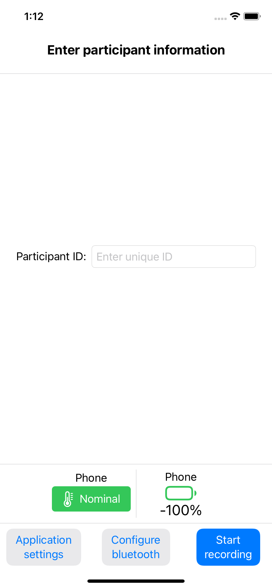
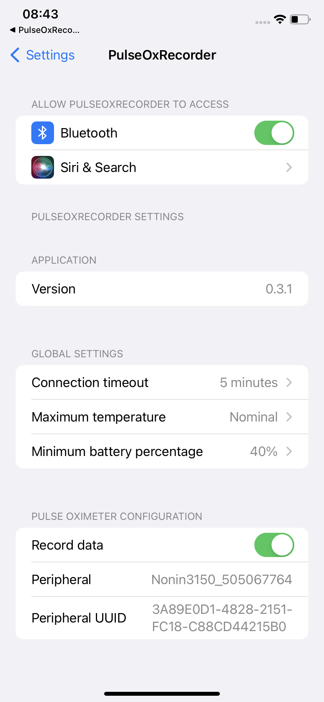
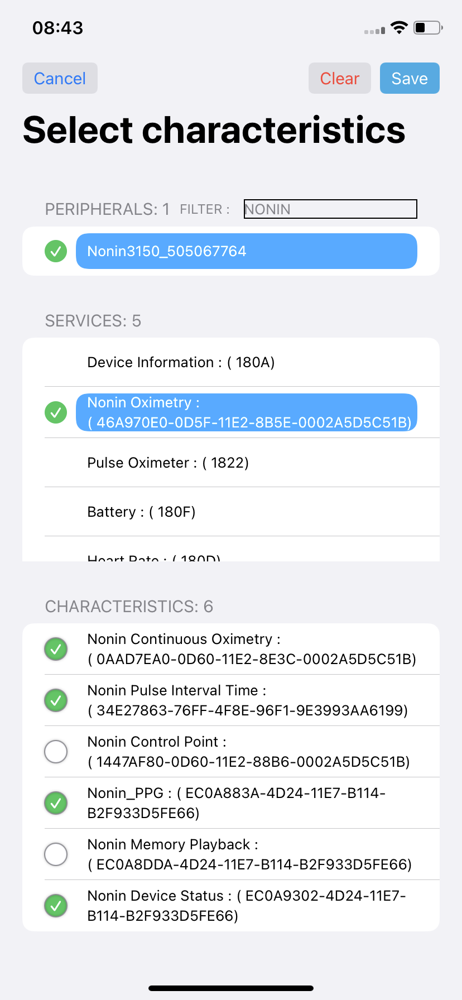
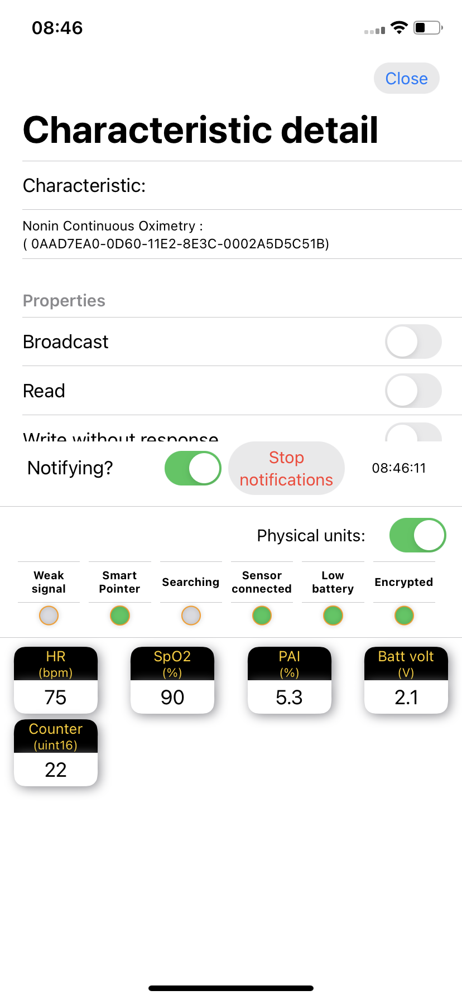
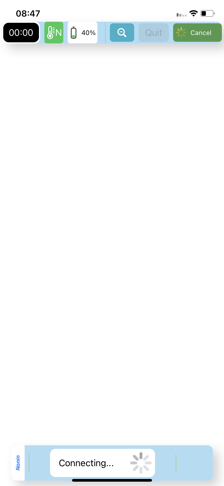
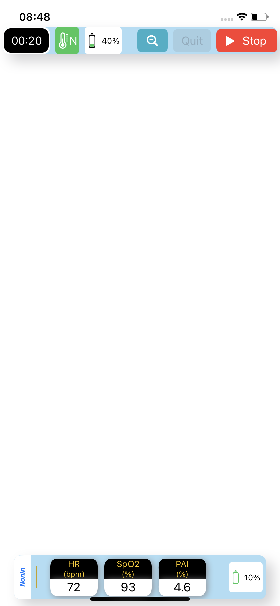
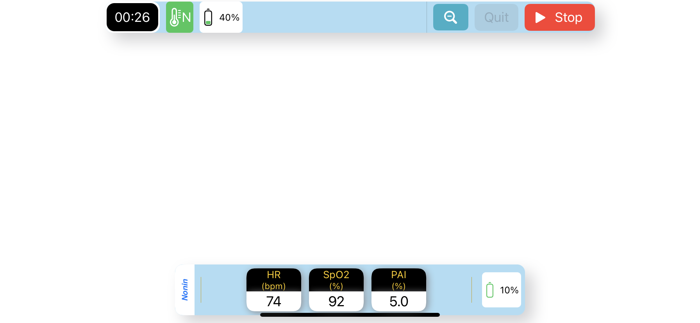
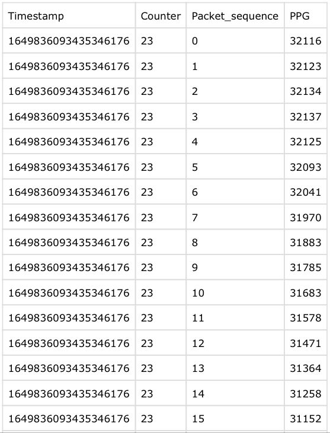
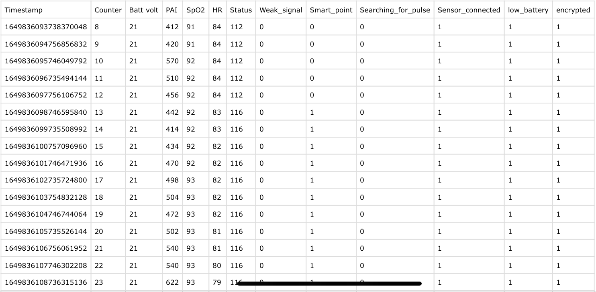

# PulseOxRecorder

This application records time-series data from devices that support Bluetooth Low Energy (BLE) protocol, such as heart rate monitors and pulse oximeters. Examples of supported time-series are heart rate, peripheral oxygen saturation (SpO<sub>2</sub>), Photoplethysmogram (PPG), battery status and more.

PulseOxRecorder is free software: you can redistribute it or modify
it under the terms of the GNU General Public License as published by the
Free Software Foundation, version 2 only. Please check the file [COPYING](COPYING) for more information on the license and copyright.

If you use this app in your projects and publish the results, please cite the following manuscript:

> Villarroel, M. and Davidson, S., 2022. Open-source mobile platform for recording physiological data. arXiv preprint arXiv:1001.0001.
<span style="color:red">(TODO: Write the paper)</span>

---

PulseOxRecorder is an iOS application written in Swift. This repository only has the a minimum set of UI classes and configuraton settings (XCode files, Settings.bundle, etc) to launch the recording interface. The main functionality to connect, record and display data is provided by the following Swift Packages:

- [swift-sensor_recording_utils](https://github.com/maurovm/swift-sensor_recording_utils): A module containing shared utility methods and classes used by other modules and applications to record raw data from sensors. 
- [swift-async_bluetooth](https://github.com/maurovm/swift-async_bluetooth): A Swift Package that replicates some of the functionality provided by Apple's CoreBluetooth module, but using Swift's latest async/await concurrency features.
- [swift-async_pulse_ox](https://github.com/maurovm/swift-async_pulse_ox): The main module that has all the functionality to connect and record data from devices that support Bluetooth Low Energy (BLE) protocol, such as heart rate monitors and pulse oximeters. 
- [swift-waveform_plotter](https://github.com/maurovm/swift-waveform_plotter): A library to plot physiological time-series such as the Photoplethysmogram (PPG).

Example of other applications making use of the above Swift Packages are:

- [swift-thermal_recorder](https://github.com/maurovm/swift-thermal_recorder): Record video from the thermal cameras such as the FLIR One.
- [swift-waveform_plotter_example](https://github.com/maurovm/swift-waveform_plotter_example): Example application to showcase the features available in the "WaveformPlotter" Swift library.


## Supported devices

All Bluetooth Low Energy devices use the Generic Attribute Profile (GATT) terminology. Data is transferred from a devices to a host application by reading the values of a given "**Characteristic**". You can check [https://www.bluetooth.com/specifications/specs] for the latest information on the Bluetooth standard

This application supports recording data from the following BLE Characteristics (check the repository [swift-async_pulse_ox](https://github.com/maurovm/swift-async_pulse_ox) for an updated list):

- 2A37 : "Heart Rate Measurement", Version 1.0 as published by the Bluetooth Standard on 2011/07/12
- 2A19: "Battery Level", Version 1.0 as published by the Bluetooth Standard on 2011/12/27
- "0AAD7EA0-0D60-11E2-8E3C-0002A5D5C51B": "Nonin Continuous Oximetry Characteristic", Version "113142-000-02" Rev B
- "EC0A9302-4D24-11E7-B114-B2F933D5FE66": "Nonin Device Status", Version "113142-000-02" Rev B
- "34E27863-76FF-4F8E-96F1-9E3993AA6199" : "Nonin Pulse Interval Time", Version "113142-000-02" Rev B
- "EC0A883A-4D24-11E7-B114-B2F933D5FE66":  "Nonin PPG", Version "113142-000-02" Rev B

Known pulse oximeters that support the above standards are:

- Nonin WristOx<sub>2</sub> Model 3150 with Bluetooth Low Energy Wrist-Worn Wireless Pulse Oximeter
- Nonin 3230 Bluetooth Low Energy Wireless Pulse Oximeter

# Application

## Main entry form screen

When you launch the application, you are presented with the following screen:



In this screen you can enter the unique identifier for the recording session and configure the application. It is important that you DO NOT include spaces for the recording identifier.

The main entry screen also displays the current battery percentage and thermal state of the phone. Possible values for the thermal state follow the ones described by "[ProcessInfo.ThermalState](https://developer.apple.com/documentation/foundation/processinfo/thermalstate)" in Swift's Foundation framework:

- **Nominal**: The thermal state is within normal limits.
- **Fair**: The thermal state is slightly elevated.
- **Serious**: The thermal state is high.
- **Critical**: The thermal state is significantly impacting the performance of the system and the device needs to cool down.

You can configure the minim required levels before launching the main recording interface in the "application settings" screen.


## Applications settings

When you press the "Application settings" buttons in the main entry form screen, you are presented with the following screen:



Here, you can choose the main configuration settings for the entire application. As the application records data from devices using BLE, make sure you enable "Bluetooth" access for the application.

Global settings:

- **Connection timeout**: When recording is started, the application will attempt to connect to the BLE device for a maximum time period before stopping the session.
- **Maximum temperature**: If the phone's thermal state is higher than this value, you will need to wait for the phone to cool down before recording data. 
- **Minimum battery percentage**: If the phone's battery level is below this value, you will need to charge it before recording data.

Pulse oximeter configuration
- **Record data**: If selected, the application will save the data to individual files. If not selected, the application will only display data on-screen.
- **Peripheral**: The name of the configured BLE device from which data will be recorded. You cannot change this value here, you need to use the "Configure bluetooth" screen.
- **Peripheral UUID**: The unique identifier of the configured BLE device from which data will be recorded. You cannot change this value here, you need to use the "Configure bluetooth" screen.

## Configure bluetooth

> Note that throughout this document we will use the terms "BLE device" and "Peripheral" interchangeably.

After you press on the "Configure bluetooth" button on the main screen, you are presented with the following screen:



The main purpose of this screen is select the BLE Characteristics to record data from. The application will display the list of BLE peripherals nearby. If the list of devices is too long (depending how many Bluetooth peripherals are around you), you can filter it by name using the search box. 

When you select the desired peripheral, the application will attempt to connect to it. It will then list the services the device advertises. Select the desired service and the list of BLE Characteristics will be displayed. You can then choose the Characteristics you want to record data from by selected the check box at the left. The Check box will display a green check mark for the selected Characteristics.

After you finish selecting all the BLE Characteristics you want to record data from, choose the "Save" button on the top right of the screen to save the configuration settings.

You also preview the data sent by the BLE peripheral for a given Characteristic. When you tap on the name of the Characteristic, the colour of the background will change to blue and a button with the label "Detail" will be displayed at the top of the list. When you press on the "Detail" button, a new screen will appear, from which you can choose the "Start notifications" button to receive data from the BLE peripheral. Some examples are shown in the following figure:

<p float="center">
    
    &nbsp; &nbsp; &nbsp;
    
</p>

## Recording screen

When you are ready to record data. Select the "Start recording" button on the main screen. You will be presented with the main recording interface. You can now press on the "Start" button in green colour at the top right corner of the screen. The application will cycle through the stages of "Connecting...", "Starting..." and finally will display the values sent by the BLE peripheral. The following figures show some examples:

<p float="center">
    
    &nbsp; &nbsp; &nbsp;
    
</p>


> Note that the application supports both portrait and landscape orientation.

To stop the recording process, just press the "Stop" button in red colour. The application will finish and you will be sent back to the main entry form screen.

## Sample output data

The application record data "locally" in your phone, in a folder with the following format:

```
PulseOxRecorder/data/PARTICIPANT_ID-yyyy_MM_dd-HH_mm_ss/DEVICE_NAME
```
where:

- PARTICIPANT_ID: The unique recording session ID entered in the main entry form screen.
- "yyyy_MM_dd-HH_mm_ss": The year_month_day-hours_minutes_seconds respectively, when the recording session started
- DEVICE_NAME: The unique name of the configured BLE device.


You can use Apple's Files app to browse the recording folder use by the app. The data is written in plain text files, one file per Bluetooth Characteristic using comma separated values (csv) format. The figures below show examples of some of the output:


<p float="center">
    
    &nbsp; &nbsp; &nbsp;
    
</p>
